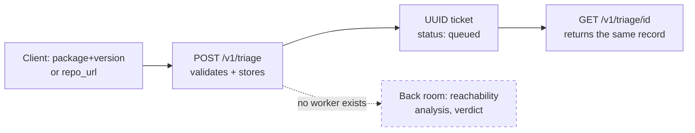

# Chapter 1: Orientation — what this is, and what it isn't yet

This chapter draws the line between the project's stated purpose and the
code that exists today. Every later chapter assumes you can tell the two
apart, so we establish it here before opening `main.py` in earnest.

## The stated purpose

`README.md` describes a triage service: a vulnerability scanner tells you
that a package you depend on has a CVE, but it can't tell you whether your
code actually calls the vulnerable function. Most of what a version-matching
scanner reports is noise. This project's job is to separate the noise from
the real risk by checking reachability.

`DECISIONS.md` fills in what that means mechanically: an agent loop against
an LLM, using tools like `search_symbol` and `find_callers` over an AST
index of a repository, returning `REACHABLE`, `NOT_REACHABLE`, or `UNKNOWN`
with file-and-line evidence. Around that agent, the plan calls for a FastAPI
+ Postgres backend, a background worker, an eval suite gating prompt
changes in CI, and defenses against prompt injection (since both the
advisory text and the repository source are attacker-controlled input
reaching a tool-using agent).

None of that agent, worker, database, or eval suite exists in this repo
yet. `README.md` says so plainly: **"Status: in development. Not usable
yet."**

## What's actually running

The entire implementation is one file, `main.py`, at 169 lines. It defines
a `FastAPI` app, a module-level Python dict used as storage, and three
routes:

```python
app = FastAPI(title="Reachability Triage Service")

# In-memory store: {UUID: {"id": UUID, "status": TriageStatus, "target": dict}}
TRIAGE_DB: dict[uuid.UUID, dict] = {}
```

`GET /healthz` returns a static `{"status": "ok"}`. `POST /v1/triage`
validates a request body, generates a `uuid.uuid4()`, stores a record in
`TRIAGE_DB` with status `QUEUED`, and returns it. `GET /v1/triage/{triage_id}`
looks that record back up by UUID. There is no database connection, no
background worker, no LLM call, and no code that ever changes a record's
status after it's created — `QUEUED` is the only status any request will
ever see, because nothing in the process reads from `TRIAGE_DB` except the
GET handler. Chapter 2 walks all three handlers in detail; for now, the
point is that this is the whole system.

## Reconciling the "Stack" line

`README.md` lists an ambitious stack under its **Stack** heading:

```
Python · FastAPI · Pydantic · pytest · PostgreSQL · SQLAlchemy · Alembic ·
Docker · Docker Compose · GitHub Actions · AWS EC2
```

Read on its own, this line implies a deployed, tested, database-backed
service. `CLAUDE.md` — the file that governs how automated agents are
allowed to describe and change this codebase — contradicts it directly, and
`CLAUDE.md` is the authoritative source when the two disagree:

```
## STABLE — do not edit mid-session (cache-critical)
- Stack as SHIPPED: Python, FastAPI, uvicorn, pydantic. Single `main.py`.
...
## NOT BUILT — do not describe these as existing
PostgreSQL, SQLAlchemy, Docker, GitHub Actions CI, async job submission,
retries/backoff, idempotency, per-user quotas, cost accounting,
content-hash caching, DB-stored prompt versioning, the eval harness.
```

`requirements.txt` settles the question by omission: it lists thirteen
packages, and every one of them is FastAPI, Pydantic, or a transitive
dependency of the two (Starlette, `anyio`, `h11`, `pydantic_core`, and so
on). There is no `sqlalchemy`, no `psycopg2` or `asyncpg`, no `boto3`, no
`pytest`. Nothing installs by running `pip install -r requirements.txt`
that would let this service talk to Postgres, run in Docker, deploy to AWS,
or run a test suite.

> **Note:** `README.md`'s Stack line also names `pytest`, but `CLAUDE.md`
> lists the test command as "none yet," and `requirements.txt` has no test
> dependency at all. AWS EC2 is named in the Stack line too but isn't
> called out explicitly in `CLAUDE.md`'s NOT BUILT list — there's simply no
> file anywhere in the repo (deployment config, `boto3` dependency, or
> otherwise) that confirms any deployment target exists. Treat the entire
> Stack line as a roadmap, not a description of the running system.

So: three sources, three different pictures. `README.md`'s Stack line is
the intended end state. `DECISIONS.md` explains why each piece was chosen,
as a plan. `CLAUDE.md` and `requirements.txt` describe what's installed and
running right now — a FastAPI app, Pydantic models, and Python's standard
library. When you read a claim in this repo about what the system does,
check it against `requirements.txt` and the actual code before repeating
it.

## Installing and running it

There's no Docker file and no build step. The run command, per
`CLAUDE.md`, is a plain `uvicorn` invocation against the single module:

```
uvicorn main:app --reload
```

Following `CLAUDE.md`'s stated package manager (pip + venv, "always this,
never switch"), a full setup from a clean checkout looks like:

```
python3 -m venv .venv
source .venv/bin/activate
pip install -r requirements.txt
uvicorn main:app --reload
```

Once it's running, `curl localhost:8000/healthz` should return
`{"status":"ok"}`. That confirms the app started, nothing more — `healthz`
doesn't check a database or a worker queue, because there isn't one to
check.

## The coat-check mental model

Think of `POST /v1/triage` as a coat-check counter at a busy venue. You
hand the attendant your coat — here, that's either a package name and
version, or a repository URL — and the attendant doesn't inspect it,
doesn't hang it up, doesn't do anything with it at all except write it
down. In exchange you get a numbered ticket (a UUID) and you're told your
coat is "queued." You can come back later, present your ticket at
`GET /v1/triage/{triage_id}`, and confirm it's still "queued." It will
always say "queued," because there is no one working in the back room.
Nobody is hanging up coats, and nobody is retrieving them. The counter is
real — it takes your claim, validates its shape, hands back a ticket, and
remembers it for as long as the process stays up — but the room behind the
counter is empty.



That's the shape of this codebase. The counter — request validation and
ticketing — is fully built, and the next four chapters take it apart in
detail. The back room — the agent that would actually determine
`REACHABLE` or `NOT_REACHABLE` and change a ticket's status — is described
in `DECISIONS.md` but doesn't exist in `main.py`. Keep that split in mind:
it's the difference between what you can call today and what the project
is ultimately for.

## Trade-offs

Building only the counter first is a reasonable way to sequence this kind
of project: get the request contract, the ID scheme, and the error shape
right before spending effort on the expensive part (an LLM agent with tool
access, per `DECISIONS.md`). The cost is that the API is not currently
useful for its stated purpose — every submission returns evidence-free
`queued` status forever, which conflicts with `CLAUDE.md`'s own convention
that "a bare true/false is not an acceptable output" for a verdict. There
is no verdict of any kind yet, so that convention hasn't been tested by
real use. Anyone evaluating this repo needs to know that up front, which is
why this chapter exists before any code walkthrough.

## Check yourself

1. Which file is authoritative when `README.md`'s Stack line and
   `CLAUDE.md`'s NOT BUILT list disagree about what's implemented, and how
   does `requirements.txt` help settle it?
2. Name three packages listed in `README.md`'s Stack line that do not
   appear anywhere in `requirements.txt`.
3. Why does a triage job's status stay `QUEUED` forever, no matter how long
   you wait after calling `POST /v1/triage`?
4. In the coat-check analogy, what does the ticket correspond to in the
   actual API, and what part of the analogy has no code behind it at all?
5. What command does `CLAUDE.md` specify for running the app, and what has
   to be true about your environment first?
