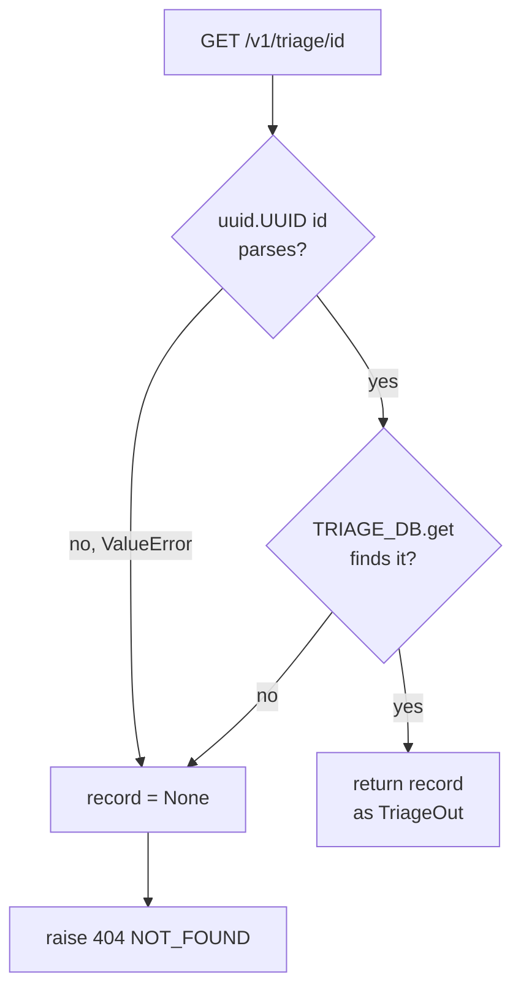

# Chapter 2: The API surface — three endpoints, read end to end

Chapter 1 established the coat-check model: hand over a claim, get a UUID
ticket, watch the status stay `queued` forever. This chapter opens the
counter and reads what each of the three routes actually does, in the order
a request hits them. Everything later in the book — validation, error
formatting, the gap between what's built and what's planned — is detail
about the handlers introduced here.

## `GET /healthz`: a liveness check with no dependencies

```python
@app.get("/healthz", status_code=status.HTTP_200_OK)
def healthz():
    return {"status": "ok"}
```

This handler reads nothing and calls nothing else in the module. It doesn't
touch `TRIAGE_DB`, open a connection, or check a queue, because none of
those exist to check. A `200` from `/healthz` confirms the process is up
and routing requests — nothing more. Chapter 1 already made this point
when walking through how to run the app; it's repeated here only to be
explicit that this is the entire handler, not an excerpt.

## `TRIAGE_DB`: the entire persistence layer

```python
# In-memory store: {UUID: {"id": UUID, "status": TriageStatus, "target": dict}}
TRIAGE_DB: dict[uuid.UUID, dict] = {}
```

This module-level dict is the only place a triage record lives. It's keyed
by `uuid.UUID` objects (not strings), and each value is a plain `dict` with
three keys: `id`, `status`, and `target`. There's no schema enforcement
beyond what `create_triage` writes into it, no expiry, and no persistence
across process restarts — a `--reload` triggered by `uvicorn` during
development wipes every record that existed before the reload, since the
dict is recreated when the module reloads.

Both route handlers that touch storage — `create_triage` and `get_triage`
— read and write this same dict directly. There's no repository class, no
data-access layer, and no async lock around it. For a single-process dev
server handling one request at a time under `uvicorn`'s default event loop,
that's not a bug; it's the simplest thing that satisfies "remember what I
was told." It would need to change the moment a second process (a worker,
a second `uvicorn` worker process, anything) needed to see the same
records — a plain Python dict in one process's memory is invisible to
everything else.

## `POST /v1/triage`: pre-allocating the ticket

```python
def create_triage(payload: TriageRequest, response: Response):
    triage_id = uuid.uuid4()

    record = {
        "id": triage_id,
        "status": TriageStatus.QUEUED,
        "target": (
            {"repo_url": str(payload.repo_url)}
            if payload.repo_url is not None
            else {"package": payload.package, "version": payload.version}
        ),
    }
    TRIAGE_DB[triage_id] = record

    response.headers["Location"] = f"/v1/triage/{triage_id}"
    return record
```

By the time this function body runs, FastAPI has already parsed the request
body into a `TriageRequest` and rejected anything that fails its
"exactly one of package+version or repo_url" rule — that rule and how a
`ValueError` inside the model becomes a `422` is the whole subject of
[Chapter 3](03-request-validation.md). Here, `payload` can be trusted: it's
either a package/version pair or a `repo_url`, never both, never neither.

The first line generates the ID with `uuid.uuid4()` before anything is
written to `TRIAGE_DB` and before any response is constructed. `DECISIONS.md`
§2 calls this out explicitly as pre-allocation: generating the ID in memory,
ahead of persistence, is what lets the handler set the `Location` header and
return `202 Accepted` without waiting on a database round trip or a
sequence generator to hand back an ID. There is no database here to round-trip
to, but the same shape holds — the ID exists before the record does, not
after.

The `target` field branches on which shape of input arrived: a `repo_url`
present means the record stores `{"repo_url": ...}` (coerced to `str`,
since `payload.repo_url` is a Pydantic `HttpUrl` object, not a plain
string); otherwise it stores `{"package": ..., "version": ...}`. This is
the only place in the handler where the two request shapes diverge.

Two details are easy to miss reading the route decorator alone:

- `status_code=status.HTTP_202_ACCEPTED` — the handler always returns
  `202`, signaling "accepted for processing," not `201 Created`. That's
  consistent with the coat-check framing: the record is written, but
  nothing has been processed yet.
- `response_model=TriageOut` — `TriageOut` only declares `id` and `status`:

  ```python
  class TriageOut(BaseModel):
      id: uuid.UUID
      status: TriageStatus
  ```

  The `record` dict returned from the handler also has a `target` key, but
  FastAPI serializes the response through `TriageOut`, so `target` is
  silently dropped from what the client sees. The caller gets back its ID
  and `"queued"` status, never an echo of what it submitted.

The `Location` header is set manually on the `response` parameter injected
by FastAPI, pointing at `/v1/triage/{triage_id}` — the same path
`get_triage` serves. That header is the handler's way of saying "here's
where to check on this later," which is exactly what the coat-check ticket
is for.

## `GET /v1/triage/{triage_id}`: one lookup, two failure causes, one response

```python
def get_triage(triage_id: str):
    record = None
    try:
        parsed_id = uuid.UUID(triage_id)
        record = TRIAGE_DB.get(parsed_id)
    except ValueError:
        pass # It's not a valid UUID, so record stays None

    if record is None:
        raise StarletteHTTPException(
            status_code=status.HTTP_404_NOT_FOUND,
            detail={
                "code": "NOT_FOUND",
                "message": f"Triage job '{triage_id}' does not exist.",
            },
        )
    return record
```

The path parameter is typed `str`, not `uuid.UUID`. That's a deliberate
choice, not an oversight: if the parameter were typed `uuid.UUID`, FastAPI
would reject a malformed ID before this function body ever ran, returning
its own `422` for a bad path parameter. Typing it `str` instead means the
handler receives whatever string arrived in the URL — well-formed UUID or
not — and parses it itself with `uuid.UUID(triage_id)` inside a `try`
block.

That parse can fail two different ways, and the handler treats them
identically. If `triage_id` isn't a syntactically valid UUID at all,
`uuid.UUID()` raises `ValueError`, which is caught, and `record` is left
`None`. If it *is* a valid UUID but no record with that key exists in
`TRIAGE_DB`, `.get()` returns `None` on its own — same result. Either way,
control falls through to the same `if record is None` check and the same
`404`. A malformed ID string ("not-a-uuid") and a well-formed but unknown
UUID (one that was never handed out, or belongs to a different run of the
process) produce byte-for-byte the same response.

Collapsing those two cases into one `404` is a real design choice with a
real cost. The alternative — a `400` for "that's not a UUID" and a `404`
for "that UUID doesn't exist" — would tell an attacker probing the
endpoint whether a given string is even shaped like a valid ID, which
narrows the search space for enumeration. Returning `404` for both means
the response gives away nothing about *why* the lookup failed, at the
price of a slightly less specific error for a client that made an honest
typo. The `detail` dict — `{"code": "NOT_FOUND", "message": ...}` — is
raised as a `StarletteHTTPException`; how that dict becomes the JSON body
the client actually receives is the subject of
[Chapter 4](04-error-handling.md).



## Trade-offs

Pre-allocating the UUID and skipping straight to `202` buys a simple,
synchronous handler with no coordination problem: by the time the response
leaves, the record already exists under that exact ID, so there's no
window where a client could `GET` a ticket that `POST` just handed it and
find nothing there. It costs the thing `202 Accepted` is supposed to imply
— that something is happening in the background — because nothing is;
Chapter 1 already covered why the status never leaves `queued`.

Collapsing malformed-ID and unknown-ID into a single `404` buys uniformity
and avoids leaking which case applies, at the cost of debuggability: a
client that sent `"12345"` instead of a UUID sees the identical error a
client sees for a UUID that simply expired or was never issued, and has to
infer the actual cause itself.

Using a bare module-level `dict` for `TRIAGE_DB` buys the simplest possible
implementation of "remember records for this process's lifetime" and
nothing else — no persistence, no concurrency safety beyond what a single
Python process's GIL happens to provide, and no way for a second process
(a worker, a second app instance) to see the same data.

## Check yourself

1. What does `create_triage` do with `payload.repo_url` differently from
   how it handles `payload.package` and `payload.version` when building the
   `target` field?
2. Why is the path parameter on `get_triage` typed `str` instead of
   `uuid.UUID`, and what would change about the handler's behavior if it
   were typed the other way?
3. A client requests `GET /v1/triage/not-a-real-uuid`. What status code do
   they get back, and why is it the same code they'd get for a
   syntactically valid UUID that was never issued?
4. `TriageOut` only declares `id` and `status`. What third key exists on
   every record stored in `TRIAGE_DB`, and why doesn't a client ever see it
   in the response from `POST /v1/triage`?
5. According to `DECISIONS.md` §2, what does generating the UUID in memory
   before writing to `TRIAGE_DB` let the handler do that it couldn't do if
   it waited until after the write?
