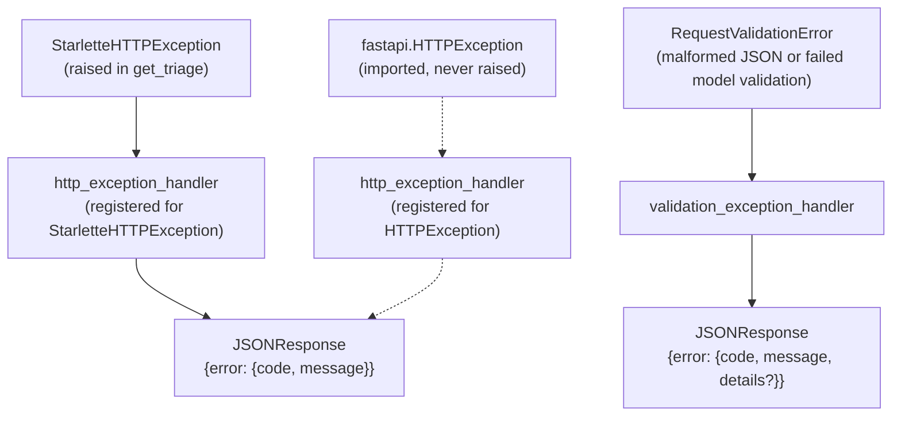

# Chapter 4: Uniform error handling

Chapter 2 raised a `StarletteHTTPException` inside `get_triage` and deferred
how its `detail` dict becomes a JSON body. Chapter 3 traced a `ValueError`
raised inside `TriageRequest`'s validator all the way to a
`RequestValidationError` arriving at a registered handler, and deferred what
that handler actually does with it. This chapter picks up both threads: the
three `@app.exception_handler` registrations near the top of `main.py`, and
the single envelope shape — `{"error": {"code", "message", ...}}` — every
one of them produces.

## Three exception types, three handlers, one shape

`main.py` registers a handler for exactly three exception types:
`StarletteHTTPException`, `HTTPException` (FastAPI's own, which subclasses
Starlette's), and `RequestValidationError`. Nothing else in the file raises
or catches an exception explicitly — these three registrations are the
entire error-handling surface of the app.

Every one of them returns a `JSONResponse` whose body is shaped
`{"error": {"code": ..., "message": ...}}`, with a status code chosen by the
handler rather than left to a default. That's the "uniform" part: whatever
went wrong — a 404 lookup miss, a raised `HTTPException`, a malformed body,
a failed `TriageRequest` validator — a client parses the response the same
way every time: look at `response["error"]["code"]`, not at the status code
alone, to know what happened.

Not every response carries the same keys, though. Only the validation
branch of `validation_exception_handler` (covered below) adds a third key,
`details`, to the envelope. The two `HTTPException`-family handlers, and the
malformed-JSON branch of the validation handler, return only `code` and
`message` — there's no `details` key present at all in those responses, not
even an empty list.

## The two `http_exception_handler` functions

```python
@app.exception_handler(StarletteHTTPException)
async def http_exception_handler(request: Request, exc: StarletteHTTPException):
    ...

@app.exception_handler(HTTPException)
async def http_exception_handler(request: Request, exc: HTTPException):
    ...
```

Both functions are named `http_exception_handler`. Read as ordinary Python,
the second `def` would look like it destroys the first — the module-level
name `http_exception_handler` can only point at one function object at a
time, and after both statements run, it points at the second.

That's true, and it's also irrelevant to how these handlers work, because
`@app.exception_handler(...)` doesn't register anything by name. Each
decorator call runs immediately, at module load time, as the `def`
statement directly below it is being bound: it takes the function object
that was just created and stores it in FastAPI's internal exception-handler
mapping, keyed by the exception type passed to the decorator —
`StarletteHTTPException` for the first, `HTTPException` for the second.
That mapping holds direct references to both function objects. The
module-level name `http_exception_handler` is a separate thing entirely: a
convenience for referring to "whichever function was last assigned to this
name" from other code in the same module. Rebinding it after the first
`def` doesn't touch the entry already written into FastAPI's dispatch
table under `StarletteHTTPException` — that entry still points at the first
function object, regardless of what the name `http_exception_handler` means
by the time the module finishes loading.

The collision would matter only if something later in `main.py` referred to
`http_exception_handler` by name — calling it directly, passing it as an
argument, decorating it again. Nothing does. Both functions are reachable
only through FastAPI's dispatch-by-exception-type mechanism, which was
already fully wired up by the time the second `def` ran.

There is a second, unrelated observation about these two handlers worth
noting directly: as of this file, only one of them ever actually fires.
`fastapi.HTTPException` is imported at the top of `main.py` but never
raised anywhere in it — the only `raise` of an HTTP-status exception in the
whole file is `raise StarletteHTTPException(...)` inside `get_triage`. So
today, every error a client sees from this app that isn't a
`RequestValidationError` goes through the *first* `http_exception_handler`
(the one registered for `StarletteHTTPException`), not the second. The
second handler's logic — importing `HTTPException` and registering a
handler for it — covers a raise site that doesn't currently exist in this
file. Since `fastapi.HTTPException` is a subclass of
`starlette.exceptions.HTTPException`, registering a handler for the
subclass makes sense as a defensive measure for code that raises the
FastAPI-flavored exception instead — it just isn't exercised by anything
that runs today.



Both `http_exception_handler` functions do the same thing, in slightly
different code shapes: check whether `exc.detail` is a dict containing a
`"code"` key (the shape `get_triage` uses when it raises
`StarletteHTTPException` with `detail={"code": "NOT_FOUND", "message": ...}`),
and unwrap it into the envelope directly if so; otherwise fall back to
`code="HTTP_ERROR"` and `message=str(exc.detail)` for any exception whose
`detail` is a plain string, which is what Starlette's own internals produce
for exceptions this app didn't raise itself (an unmatched route, for
example, which Starlette turns into a `404` with a string `detail`).

```python
if isinstance(exc.detail, dict) and "code" in exc.detail:
    code = exc.detail.get("code")
    message = exc.detail.get("message", str(exc.detail))
else:
    code = "HTTP_ERROR"
    message = str(exc.detail)
```

This is the mechanism behind the `NOT_FOUND` response from Chapter 2: the
handler doesn't invent that code, it reads it straight out of the `detail`
dict `get_triage` constructed. Any future route that wants a specific error
`code` in its response gets one for free by raising a `StarletteHTTPException`
with a `detail={"code": ..., "message": ...}` dict — no changes needed to
either `http_exception_handler`.

## `validation_exception_handler`: three steps, in order

```python
@app.exception_handler(RequestValidationError)
async def validation_exception_handler(request: Request, exc: RequestValidationError):
    errors = exc.errors()
```

`exc.errors()` is a list of dicts — Pydantic's structured description of
everything that went wrong, one entry per failed field or validator. The
handler works through that list in three steps.

**Step 1 — detect malformed JSON.** Before looking at anything
field-specific, the handler checks whether the *first* error is the one
Pydantic/FastAPI produce when the request body isn't valid JSON at all:

```python
if errors and errors[0].get("type") == "json_invalid":
    return JSONResponse(
        status_code=status.HTTP_400_BAD_REQUEST,
        content={"error": {"code": "MALFORMED_JSON", "message": "Malformed JSON payload."}}
    )
```

When the body can't even be parsed as JSON, there's nothing to say about
individual fields — `errors` in that case is a single-entry list describing
the parse failure itself, not a `TriageRequest` field problem. The code
returns early here with a fixed message and `400 Bad Request`, short-
circuiting the rest of the function.

> **Note:** `DECISIONS.md` §3, under "JSON Parse Errors," states the
> opposite: "FastAPI routes malformed JSON strings directly through
> Starlette's `RequestValidationError`... returning `422 Unprocessable
> Entity` by default, not `400`. We preserve this framework behavior: all
> request body contract failures (syntactic or semantic) produce `422`."
> The code in front of you does not do that — it explicitly detects
> `json_invalid` and returns `400` with `code: "MALFORMED_JSON"`, a status
> this document was written to avoid. This chapter is not resolving which
> one is correct. It's flagging that the design document and the running
> code disagree on the status code for a malformed request body, and that's
> an open question for whoever owns this repo to settle, not a documented
> or intentional discrepancy.

**Step 2 — build the top-level message.** For every other kind of
validation failure (a missing field, a wrong type, or the `ValueError`
raised inside `_validate_exactly_one_target` from
[Chapter 3](03-request-validation.md)), the handler picks a single message
to surface as `error.message`:

```python
first_msg = errors[0].get("msg") or "Validation error" if errors else "Validation error"
if first_msg.startswith("Value error, "):
    first_msg = first_msg[len("Value error, "):]
```

The `or "Validation error"` guard means an empty or missing `msg` key on
the first error — however unlikely, given that Pydantic always populates
this field — falls back to a fixed string instead of surfacing `None` or an
empty string as the client-facing message; the `if errors else` guard
covers the separate case where `errors` itself is an empty list. Both
guards exist to keep this line from raising inside the exception handler
itself, which would otherwise turn a `422` into an unhandled `500`. The
prefix strip that follows is the same mechanism Chapter 3 pointed at as
direct evidence of the `ValueError` path: Pydantic prepends `"Value error, "`
to any message raised from inside a validator, and this line removes it so
`_validate_exactly_one_target`'s messages ("Must provide either ('package'
and 'version') OR 'repo_url'.", for instance) reach the client without the
Pydantic-internal prefix attached.

**Step 3 — build `details`.** Only after the message is settled does the
handler build the list attached to `details`:

```python
safe_details = [{"loc": err.get("loc", []), "msg": err.get("msg", "")} for err in errors]
```

This walks every entry in `errors` — not just the first — and keeps only
`loc` (the field path Pydantic identified, e.g. `["body", "version"]`) and
`msg`, dropping everything else Pydantic's error dicts normally carry, such
as `type`, `input`, `url` (a link to Pydantic's own documentation for that
error type), and `ctx`. Stripping those keys is what "safe" in the name
`safe_details` refers to: none of Pydantic's internal error metadata, or
the raw `input` value that failed validation, reaches the client.

The function returns with both pieces assembled:

```python
return JSONResponse(
    status_code=status.HTTP_422_UNPROCESSABLE_ENTITY,
    content={
        "error": {
            "code": "VALIDATION_ERROR",
            "message": first_msg,
            "details": safe_details,
        }
    },
)
```

`422` here is uncontroversial — it matches both the code and
`DECISIONS.md` §3's description of ordinary field-validation failures. The
disagreement flagged above is specific to the `json_invalid` branch that
returns before this point is ever reached.

## Trade-offs

Registering handlers by exception type, rather than building one
handler that branches on `type(exc)`, buys FastAPI-idiomatic dispatch and
lets each handler stay short — but it's also what makes the
`http_exception_handler`/`http_exception_handler` naming collision possible
in the first place. The two functions could have been named distinctly
(`starlette_http_exception_handler` and `fastapi_http_exception_handler`,
for instance) at zero cost, since nothing about the decorator requires the
name to relate to the exception type. That the code works anyway is a
property of how `@app.exception_handler` happens to register things, not
evidence that the naming was deliberate.

Stripping error responses down to `code`, `message`, and (for validation
errors) a minimal `details` list buys a client-facing contract that never
leaks Pydantic's internal error schema, stack traces, or raw offending
input. It costs debuggability on the server side: nothing in any of these
three handlers logs the original exception before responding, so if a
request fails validation in a way that's surprising, the only record of it
is whatever the client received — there's no server-side trace to go back
and inspect afterward.

Detecting `json_invalid` as a special case before falling through to the
general `422` path buys a more specific error code (`MALFORMED_JSON`
instead of a generic `VALIDATION_ERROR` with an unhelpful `details` list)
for the one failure mode where per-field detail genuinely doesn't apply.
It costs consistency with the rest of the validation-error family: every
other `RequestValidationError` in this file becomes a `422`, and this one
branch alone becomes a `400` — a difference `DECISIONS.md` doesn't currently
account for.

## Check yourself

1. Both `StarletteHTTPException` and `HTTPException` handlers are Python
   functions named `http_exception_handler`. Why does this not cause one
   handler to silently overwrite or replace the other in FastAPI's
   dispatch?
2. As of this file, which of the two `http_exception_handler` functions
   ever actually runs when a client hits `GET /v1/triage/{triage_id}` with
   an unknown ID, and why does the other one never fire?
3. What status code and error `code` does the running code return for a
   request body that isn't valid JSON at all, and what does `DECISIONS.md`
   §3 say the status code should be instead?
4. In `validation_exception_handler`, what does the `or "Validation error"`
   guard in the `first_msg` line protect against, and what would happen
   without it if `errors[0]["msg"]` were an empty string?
5. Which keys does `safe_details` keep from each entry in `exc.errors()`,
   and which ones does it deliberately drop?
