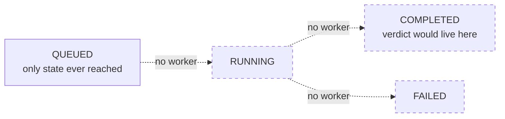

# Chapter 5: Trade-offs and open questions

The first four chapters read `main.py` end to end: the two endpoints that
work, the validator that guards them, and the three handlers that format
every failure the same way. This chapter steps back. It maps `CLAUDE.md`'s
NOT BUILT list against what `DECISIONS.md` actually says about each missing
piece, explains precisely why a triage record can never show anything but
`queued`, and closes by collecting every discrepancy the last four chapters
flagged along the way into one list.

## What NOT BUILT maps to in `DECISIONS.md`

`CLAUDE.md` names twelve things as not built: PostgreSQL, SQLAlchemy,
Docker, GitHub Actions CI, async job submission, retries/backoff,
idempotency, per-user quotas, cost accounting, content-hash caching,
DB-stored prompt versioning, and the eval harness. Reading `DECISIONS.md`
against that list, the twelve split into three groups by how much the
design document actually says about them.

**Named with a phase number.** Two items get a specific, numbered
deferral. `DECISIONS.md` §1's state machine notes that if a worker dies
mid-analysis, a job could get stuck in `RUNNING` forever, and says handling
that — "dead-worker recovery and stale job timeouts" — is "deferred to
Phase 4 (Worker Pool)." §3's security note on `repo_url` says SSRF
protection (blocking requests to things like the `169.254.169.254` cloud
metadata endpoint) is "deferred to Phase 5, when worker git cloning is
implemented." Both of these read as genuine sequencing decisions: the
document knows the gap exists, names the phase that closes it, and gives a
reason (there's no worker yet, so there's nothing to protect against SSRF
from yet either).

**Named only in the opening paragraph, with no phase.** PostgreSQL,
SQLAlchemy, Docker, GitHub Actions CI, async job submission,
retries/backoff, and the eval harness all trace back to `DECISIONS.md`'s
unnumbered introduction, which describes "a FastAPI + Postgres backend
with a background worker, an eval suite gating every prompt change in
CI." That sentence establishes intent but commits to no phase, no order,
and no rationale beyond "this is the target architecture." §1 does add one
concrete constraint that touches retries directly: `FAILED` is an
immutable terminal state, and "retries must be submitted as new triage
jobs." That's a real decision — it rules out an automatic retry mechanism
that resubmits a failed job under its own ID — but it's not the same thing
as a plan for the retry/backoff behavior `CLAUDE.md` lists as not built.

**Not named anywhere.** Per-user quotas, cost accounting, content-hash
caching, and DB-stored prompt versioning appear in `CLAUDE.md`'s NOT BUILT
list and nowhere in `DECISIONS.md` — not in the introduction, not in any of
the three numbered sections. `CLAUDE.md` is explicit that these are
excluded from any claim of working code, but the design document that's
supposed to hold the rationale for future work is silent on why any of the
four are needed or when they'd arrive. That gap is worth naming plainly:
it means a reader who wants to know *why* the project will eventually need
per-user quotas or content-hash caching has no document in this repo to
consult. It's simply not written down yet.

## Why every job reads "queued" forever

`DECISIONS.md` §1 defines four legal transitions: `QUEUED` → `RUNNING`
("Worker begins execution"), `QUEUED` → `FAILED` (rejected before
execution), `RUNNING` → `COMPLETED`, and `RUNNING` → `FAILED`. Every one of
those transitions is triggered by something a worker does — picking up a
job, finishing it, crashing on it. [Chapter 1](01-orientation.md) already
established that no worker exists in this repo; the only Python file at the
project root is `main.py`, and nothing in it runs on a schedule, polls a
queue, or does anything after the HTTP response for `POST /v1/triage` has
been sent.

Concretely: `create_triage` is the only place in the entire file that
assigns a value to a record's `status` key, and it always assigns the same
one.

```python
record = {
    "id": triage_id,
    "status": TriageStatus.QUEUED,
    ...
}
TRIAGE_DB[triage_id] = record
```

`get_triage` only reads `TRIAGE_DB` — it has no assignment to any key of
any record at all. There is no third function, no background task, no
scheduled job anywhere in `main.py` that could reach into `TRIAGE_DB` and
flip a record's `status` from `TriageStatus.QUEUED` to `TriageStatus.RUNNING`.
The enum declares four members; the process, as written, is only ever
capable of constructing the first one. This isn't a bug to fix inside
`main.py` — there's no missing `if` statement or forgotten call. The
`QUEUED → RUNNING` transition requires a second thing (a worker) to exist
and to run, and that second thing is exactly what `CLAUDE.md`'s NOT BUILT
list and `DECISIONS.md`'s unphased introduction both say hasn't been built.

## Why `TriageOut` has no verdict field

`DECISIONS.md` §1 says reachability findings — `REACHABLE`, `NOT_REACHABLE`,
`UNKNOWN` — are meant to be "recorded as payload attributes inside [the
`COMPLETED`] state, not separate top-level states." That sentence describes
where a verdict *should* live once one exists. It doesn't exist today.

```python
class TriageOut(BaseModel):
    id: uuid.UUID
    status: TriageStatus
```

This is the only response model `main.py` defines, and both routes that
return a body (`create_triage`, `get_triage`) are declared with
`response_model=TriageOut`. There is no field here for a verdict, evidence,
a call path, or anything resembling the "payload attributes" §1 describes.
That's consistent with the rest of the file: since no code path ever
produces a `COMPLETED` record, there's never been a value to put in such a
field, so it was never added. But it's worth being precise about what's
missing and what isn't. This isn't a field that's present-but-empty,
waiting to be filled in later — `TriageOut` would need to be changed before
it could hold a verdict at all. `CLAUDE.md`'s own convention — "reachability
verdicts must carry their evidence... a bare true/false is not an
acceptable output" — has accordingly never been exercised by this codebase.
There's no code path yet where that convention could be violated or upheld,
because there's no code path that produces a verdict.



## Trade-offs

Writing `DECISIONS.md` as a set of dated, numbered sections for only the
pieces that were actually being built (identifier format, request shape,
the state machine's legal transitions) — while leaving the rest of the
architecture in an unnumbered opening paragraph — buys a document that's
honest about what's been decided versus what's merely intended. It costs
the reader a document that can answer "why" for the pieces in that
opening paragraph. Two deferred items (dead-worker recovery, SSRF
protection) got specific phase numbers and reasons; the rest didn't, and
nothing distinguishes "we haven't decided yet" from "we forgot to write
it down" from the document alone.

Building the counter (validation and ticketing, per [Chapter 1](01-orientation.md)'s
mental model) before the back room is a reasonable sequencing choice: it
lets the request contract, ID scheme, and error envelope get exercised and
stabilized before the more expensive and riskier part — an LLM agent with
tool access reading attacker-controlled input — gets built on top of them.
The cost is the one this chapter has been making concrete: today, nothing
in this repo can produce the thing the project exists to produce. Every
submission is accepted, assigned an ID, and left at `queued` forever.

## Open questions

Collected here are every discrepancy or gap flagged across all five
chapters — code that doesn't match `DECISIONS.md`, `README.md`, or
`CLAUDE.md`, or a validation gap found by working through the code
directly. None of these are resolved in this book; they're listed so
whoever picks this repo up next doesn't have to rediscover them.

1. **README Stack line vs. `CLAUDE.md` NOT BUILT ([Chapter 1](01-orientation.md)).**
   `README.md`'s Stack line names `pytest` and `AWS EC2`. Neither is
   addressed cleanly by `CLAUDE.md`: the test command is listed as "none
   yet" (implying `pytest` isn't wired up, but not saying so directly),
   and AWS EC2 isn't mentioned anywhere in the NOT BUILT list at all,
   despite no deployment config or AWS dependency existing anywhere in the
   repo.

2. **Empty-string package/version pass validation ([Chapter 3](03-request-validation.md)).**
   `TriageRequest`'s `_validate_exactly_one_target` checks presence with
   `is not None`, not truthiness. `{"package": "", "version": ""}` passes
   both the XOR check and the "both given" check, because an empty string
   is still "not None." Nothing later in `main.py` inspects the contents
   of `package` or `version` again, so this request is accepted as valid
   input and stored as-is. `repo_url` doesn't share this gap, because
   Pydantic's `HttpUrl` field type rejects an empty or unparseable URL
   string before the model-level validator ever runs.

3. **Malformed JSON: `400` in code vs. `422` in `DECISIONS.md` ([Chapter 4](04-error-handling.md)).**
   `DECISIONS.md` §3, under "JSON Parse Errors," says the app "preserves"
   FastAPI's framework default and returns `422` for a body that isn't
   valid JSON. The running code does the opposite: `validation_exception_handler`
   explicitly detects `errors[0].get("type") == "json_invalid"` and returns
   `400 Bad Request` with `code: "MALFORMED_JSON"` — a status the design
   document says it was written to avoid. Which one is correct is not
   settled anywhere in this repo.

4. **`fastapi.HTTPException` imported but never raised ([Chapter 4](04-error-handling.md)).**
   `main.py` imports `HTTPException` from `fastapi` and registers a handler
   for it, but the only exception ever raised for an HTTP-status error
   anywhere in the file is `starlette.exceptions.HTTPException`, raised
   inside `get_triage`. As of this file, the `HTTPException`-registered
   handler is dead code: it's wired up correctly and would work if
   something raised that exception type, but nothing does.

5. **`CLAUDE.md`'s NOT BUILT list is broader than `DECISIONS.md`'s
   documented rationale (this chapter).** Per-user quotas, cost
   accounting, content-hash caching, and DB-stored prompt versioning are
   all named in `CLAUDE.md` as not built, but none of the four appears
   anywhere in `DECISIONS.md` — not in a numbered section, not in the
   unphased introduction. Only two deferred items in the whole NOT BUILT
   list (dead-worker recovery, SSRF protection) have an explicit phase
   number and stated reason behind them.

6. **`CLAUDE.md` points at a diagrams directory that doesn't exist (this
   chapter).** `CLAUDE.md`'s POINTERS section says "Diagrams:
   `agent_docs/`." No such directory exists anywhere in this repository.
   This is a minor pointer-hygiene gap rather than a behavioral one, but
   it's the kind of thing that wastes a reader's time if they go looking.

## Check yourself

1. Of the twelve items on `CLAUDE.md`'s NOT BUILT list, which two are
   given an explicit phase number in `DECISIONS.md`, and what event does
   each phase wait for?
2. Which specific function in `main.py` is the only place that ever
   assigns a value to a record's `status` key, and which value is it
   always assigned?
3. `DECISIONS.md` §1 says reachability findings should be recorded as
   "payload attributes" inside the `COMPLETED` state. What would have to
   change about `TriageOut` before that could happen?
4. Name the two discrepancies between the running code and `DECISIONS.md`
   that [Chapter 4](04-error-handling.md) flagged, and state which one
   involves a status code disagreement and which one involves dead code.
5. Why does `{"package": "", "version": ""}` pass `TriageRequest`'s
   validator, and why doesn't the equivalent problem apply to `repo_url`?
